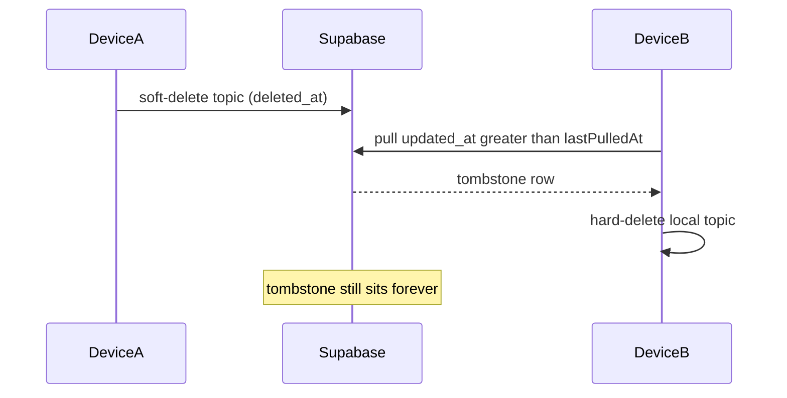

# Tombstone garbage collection via device watermarks

## Problem

Today, deletes are **hard locally** and **soft in Supabase** ([`sync.service.ts`](src/services/sync.service.ts) push sets `deleted_at`). Other devices learn about deletes on pull, which is correct — but tombstones stay forever. There is no device identity, so the server cannot know when it is safe to hard-delete.



## Recommended approach (default)

**Device registry + watermark GC**, not per-row ack lists.

Insight you already have: each device’s `lastPulledAt` is enough. After a successful pull, if `device.last_pulled_at >= row.deleted_at` (actually `>= row.updated_at` of the tombstone), that device has seen and applied the delete. Once **every active device** for the user is past that watermark, the tombstone is unused and can be hard-deleted.

### Rules

1. **Register a device** — stable UUID in IndexedDB `sync_meta` (`deviceId`). On every sync, upsert into `sync_devices`.
2. **Single active device** — on delete push, hard-`DELETE` the row instead of soft-delete. No tombstone needed (CASCADE removes child cards).
3. **Multiple active devices** — keep soft-delete as today; after pull, purge tombstones where `deleted_at <= min(active devices.last_pulled_at)`.
4. **Active device** — `last_seen_at` within **30 days**. Older device rows are ignored for the min (and can be deleted).
5. **Safety TTL** — also hard-delete any tombstone older than **30 days**, even if some device never returned. Prevents unbounded growth when a phone is lost.
6. **Stale device returns** — if this device was inactive longer than the TTL (or has no prior `last_seen`), run a **reconcile**: pull all _live_ topic/card IDs for the user and hard-delete local rows that are not live remotely and not pending in `sync_queue`. That closes the resurrection hole (offline device kept a topic whose tombstone was already GC’d).

Defaults (30d / 30d) are fixed for now; easy to tune later.

## Schema

New migration alongside [`001_cloud_sync.sql`](supabase/migrations/001_cloud_sync.sql):

```sql
create table public.sync_devices (
  id uuid primary key,              -- client-generated device id
  user_id uuid not null references auth.users(id) on delete cascade,
  last_pulled_at timestamptz not null default 'epoch',
  last_seen_at timestamptz not null default now(),
  user_agent text
);

-- RLS: users manage own rows
-- index (user_id, last_seen_at)
```

Optional RPC `purge_synced_tombstones()` (security definer or plain SQL under RLS) so GC is one round-trip and atomic:

- Count/consider devices with `last_seen_at > now() - 30 days`
- `DELETE` from `topics` / `cards` where `deleted_at is not null` and (`deleted_at <= min(last_pulled_at)` of those devices **or** `deleted_at < now() - 30 days`)
- Delete stale `sync_devices` rows

Hard-deleting a soft-deleted **topic** CASCADE-deletes its cards (existing FK), which is fine for topic tombstones. Card-only tombstones still need explicit card DELETE.

## Client changes ([`src/services/sync.service.ts`](src/services/sync.service.ts))

Per sync cycle:

1. Ensure `deviceId` in `sync_meta`.
2. `pushChanges` — for `delete`:
   - If active device count is 1 (self only): `.delete()` hard remove.
   - Else: soft-update `deleted_at` as today.
3. `pullChanges` — unchanged tombstone → local hard-delete; then write `lastPulledAt`.
4. Upsert `sync_devices` with this device’s `last_pulled_at` + `last_seen_at`.
5. Call `purge_synced_tombstones` (or equivalent client deletes).
6. If returning after inactivity > TTL: reconcile live IDs before or instead of incremental pull.

Touch points: [`src/lib/db.ts`](src/lib/db.ts) / `sync_meta` keys only; no change to local Topic soft-delete model (`Topic.deletedAt` can stay unused).

## Why not alternatives

| Approach                | Why not (for this app)                                                                                  |
| ----------------------- | ------------------------------------------------------------------------------------------------------- |
| Per-tombstone ack table | More rows, more writes; watermark already encodes “seen everything up to T”                             |
| TTL only                | Works, but ignores your single-device / all-synced cases and keeps junk for N days even with one laptop |
| Ack forever, never TTL  | Lost/abandoned devices block GC indefinitely                                                            |

## Edge cases to handle in implementation

- **Queue has topic delete + card deletes** — hard-deleting the topic cascades; subsequent card deletes should no-op cleanly (ignore “not found”).
- **Upsert after remote delete** — existing resurrection risk if offline create/upsert races a tombstone; out of scope unless we tighten LWW on pulls (do not change delete semantics in this work except GC).
- **New device** — first sync inserts device row with `last_pulled_at` after pull; until then min watermark excludes it only after first successful sync report. New devices start at epoch, pull all live + tombstones, then raise watermark — then GC can proceed.

## Scope / non-goals

- No UI for managing devices (unless you ask later).
- No change to local hard-delete UX.
- Cards follow the same tombstone + GC rules as topics.
